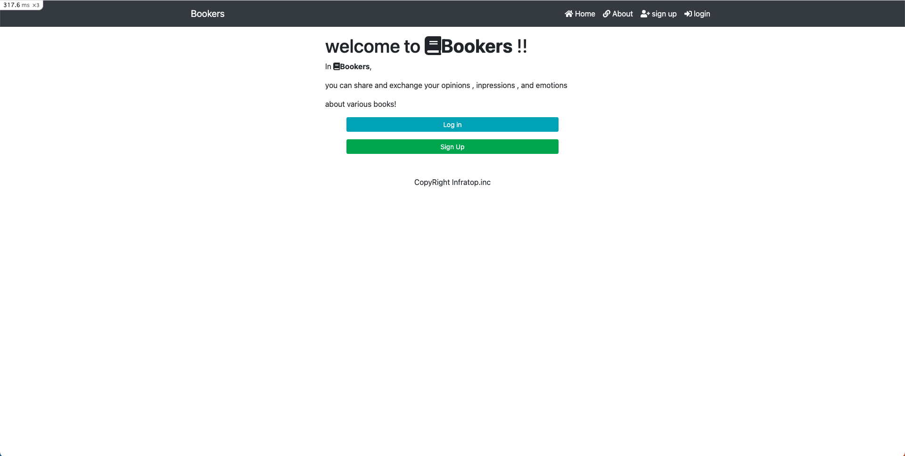
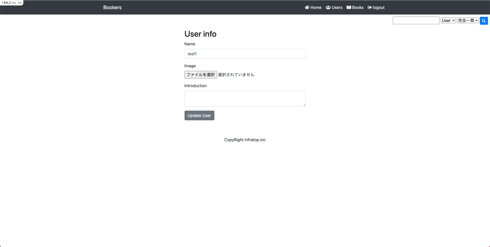
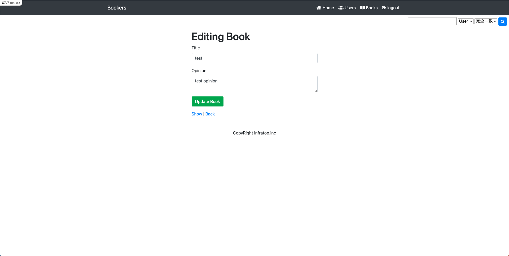
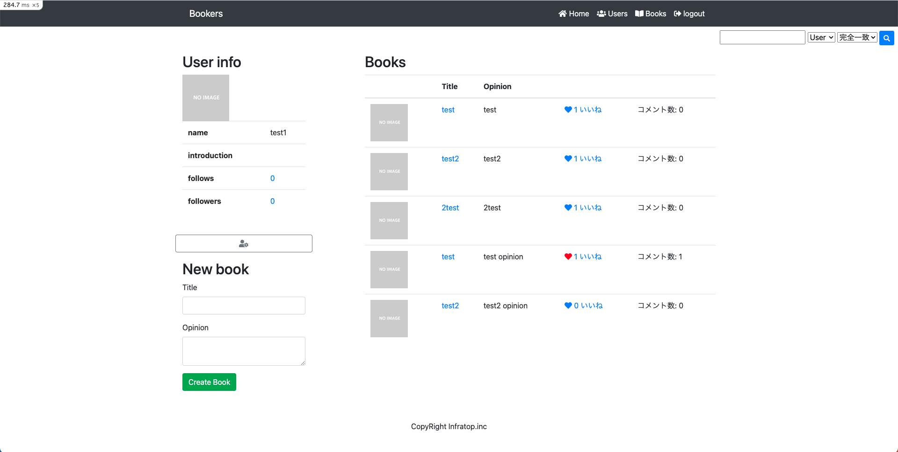
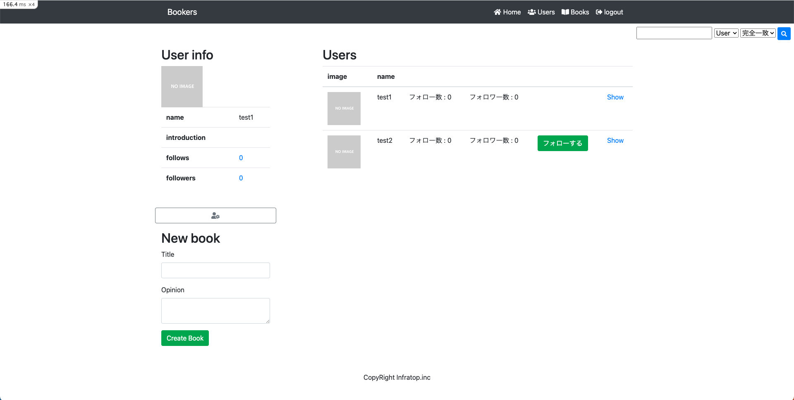
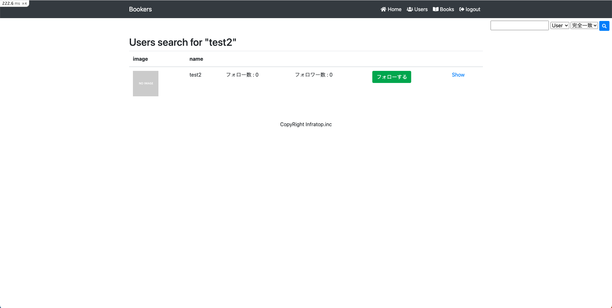

# [Bookers2_ver3](https://github.com/ryhara/Bookers2_ver3)
**本の感想投稿 + いいね、コメント機能の非同期通信化 + 検索機能 + フォロー/フォロワー機能**

- 本のタイトルと感想を投稿、閲覧、編集、削除が可能
- ユーザーの登録、ログイン、ログアウト、ユーザー情報の編集が可能
- 他のユーザーの投稿も閲覧可能
- 他のユーザーの投稿にいいねやコメントが可能
- JavaScript, jQueryを用いたいいね、コメント機能の非同期通信化
- 他のユーザーのフォローが可能、フォロー、フォロワーの一覧も可能、X(旧Twitter)のイメージ
- UserとBookの2種類で検索可能、完全一致、前方一致、後方一致、部分一致で検索が可能（検索機能未実装

## Images
<p align="center">
  
  
  
  
  
  
  
  
  
</p>


## Usage
```
$ bundle install
$ rails webpacker:install (when asked, answer Y)
$ rails webpacker:compile
$ rails db:migrate
($ rails db:seed)
```
```
$ rails s
```
If "Webpacker::Manifest::MissingEntryError" occur
```
$ yarn add @babel/plugin-proposal-private-methods @babel/plugin-proposal-private-property-in-object
```

## Version
- Rails 6.1.7.3
- ruby 3.1.2p20 (2022-04-12 revision 4491bb740a) [x86_64-linux]
- node v16.19.0
- yarn 1.22.19
- Version: ImageMagick 7.1.1-5 Q16-HDRI x86_64 92a5afcfa:20230326 https://imagemagick.org
  - Copyright: (C) 1999 ImageMagick Studio LLC
  - License: https://imagemagick.org/script/license.php
  - Features: Cipher DPC HDRI OpenMP(4.5)
  - Delegates (built-in): jng jpeg lzma png tiff xml zlib
  - Compiler: gcc (7.3)
- sqlite3 3.42.0

